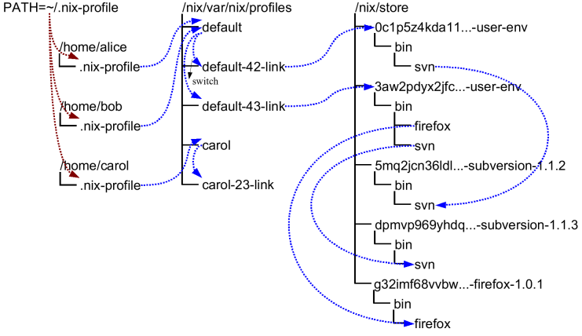

% How immutable infrastructure and declarative configuration removed the pain of managing my servers
% David Sferruzza
% 16/09/2016


# About me

- [\@d_sferruzza](https://twitter.com/d\_sferruzza)
- [github.com/dsferruzza](https://github.com/dsferruzza)
- raptor trainer at [Startup Palace](http://www.startup-palace.com) *!!! FIXME !!!*
- PhD student in software engineering at *University of Nantes*

<figure class="stretch"></figure>


# Startup Palace

We **iteratively** design and develop web applications. <small>(among other things)</small>

Frequent reviews by the customers (and by the team) are an important part of the job.

> We need staging/preprod environments

<figure class="stretch"></figure>


# Staging environments

They should be:

- quick to create
- quick to configure
- quick to remove
- cheap
- compatible with automatic deployment

<figure class="stretch"></figure>


# About automatic deployment

We use [GitLab](https://about.gitlab.com/)

<figure class="stretch"></figure>

> GitLab unifies chat, issues, code review, CI and CD into a single UI


# About automatic deployment

GitLab CI is very flexible:

```yaml
my_deploy:
  stage: deploy
  image: org/my_docker_image
  script:
    - echo "I can do anything here"
    - rsync ./my_projet $USER@$HOST:/var/www/
  only:
    - master
  tags:
    - docker
```


# Naive solution

We know [Debian](https://www.debian.org/). Let's use Debian!

And let's install **and** *configure*:

- Apache
- PHP
- PostgreSQL
- SSH

*by hand*!

<figure class="stretch"></figure>


# Naive solution

It works but:

- it needs a lot of manual setup<br>=> admins need to be watchful and rigorous
- environments can diverge<br>=> it can quickly become a mess
- security/system updates can break stuff<br>=> you need to fix environments one by one
- it's soooo **boring** to use

> Boring means I will make mistakes


# Naive solution

We did it for a while.

*1 star. Would not recommend.*

<figure class="stretch"></figure>

So, can we do better?


# Dockerfile

At that time, people were talking a lot about Docker. So I took a look.

The concept of the **Dockerfile** is interesting:

- you start from an existing image
- you *declare* how to change it
- you get a new image

```dockerfile
FROM debian:jessie
RUN apt-get update \
 && apt-get install --no-install-recommends -y \
    openjdk-7-jdk
```


# Dockerfile

This is fine. But:

- you declare **how** to build an image<br>not **what** is the image you want to build
- this is too linear (cache)
- it's hard to compose
- ...

<figure class="stretch"></figure>


# Declarative vs imperative

> **Imperative programming**: use statements that change a program's state
>
> **Declarative programming**: express the logic of a computation without describing its control flow

- imperative: shopping instructions
- declarative: shopping list


# The NixOS project

> <figure class="stretch"></figure>
> <https://nixos.org/>

- Nix
- Nix Expression Language
- NixOS (distribution)
- ...

<div class="notes">
Created by *Eelco Dolstra* for its PhD
</div>


# Nix

> The Purely Functional Package Manager
>
> <https://nixos.org/nix/>

Packages:

- are treated like values
- are built by functions that don't have side-effects
- never change after they have been built

Builds are **reproducible**.


# Nix store

Where packages are stored. Usually in `/nix/store/`

Example:<br><small>`/nix/store/f4gxsj6pn4ygqadwyk2m6xg1ywhfwxg1-openssl-1.0.2h/`</small>

A package's directory name contains:

- it's name
- it's version
- a unique identifier that captures all its dependencies

<div class="notes">
unique identifier = a cryptographic hash of the package’s build dependency graph
</div>


# Nix

Nice features:

- multiple versions
- complete (and explicit) dependencies
- multi-user
- atomic upgrades and rollbacks
- transparent source/binary deployment

<figure class="stretch"></figure>

<div class="notes">
build & runtime dependencies
</div>


# Nix Expression Language

> It is a pure, lazy, functional language.
>
> It is **not** a general purpose language.

Types of expressions:

- strings, integers, paths, booleans, null
- functions/lambdas
- lists
- sets
- derivations


# Nix Expression Language

```nix
# This is a list of strings
[ "a" "b" ''c'' "var=${var}" ]

# This is a lambda
f = x: x * x

# This is a set
{ a = 5; b = f 2; }

# This is a recursive set
rec { a = b + 1; b = 5; }
```

# The `which` package

<div class="smallcode">
```nix
{ stdenv, fetchurl }:

stdenv.mkDerivation rec {
  name = "which-2.21";

  src = fetchurl {
    url = "mirror://gnu/which/${name}.tar.gz";
    sha256 = "1bgafvy3ypbhhfznwjv1lxmd6mci3x1byilnnkc7gcr486wlb8pl";
  };

  meta = with stdenv.lib; {
    homepage = http://ftp.gnu.org/gnu/which/;
    platforms = platforms.all;
    license = licenses.gpl3;
  };
}
```
</div>

# User environments

<figure class="stretch"></figure>
